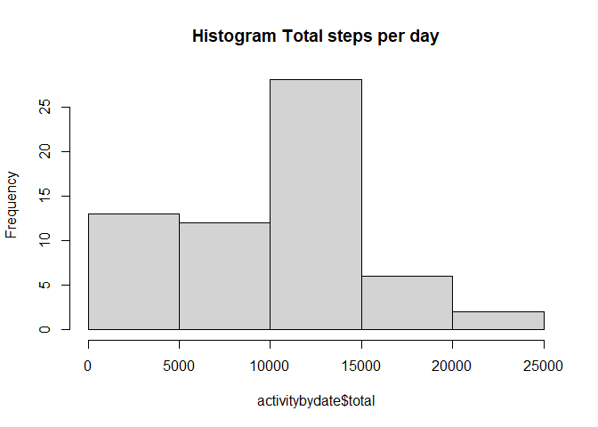
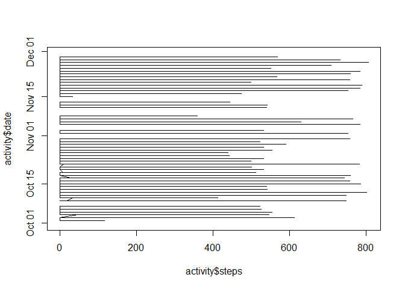
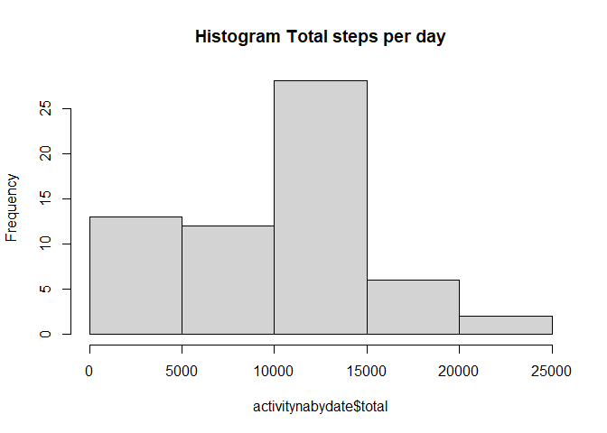
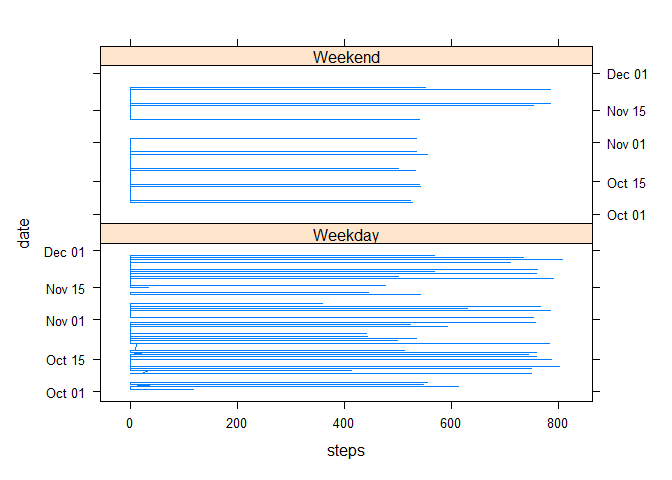

## Loading and preprocessing the data


```r
path <- "C:/Users/mrsca/OneDrive - Deadlock Solutions, SRL/Entrenamientos/Coursera/R/RepData_PeerAssessment1/activity/activity.csv"
activity<- read.csv(path)
library (dplyr)
```

```
## Warning: package 'dplyr' was built under R version 4.2.3
```

```
## 
## Attaching package: 'dplyr'
```

```
## The following objects are masked from 'package:stats':
## 
##     filter, lag
```

```
## The following objects are masked from 'package:base':
## 
##     intersect, setdiff, setequal, union
```

```r
library (lubridate)
```

```
## Warning: package 'lubridate' was built under R version 4.2.3
```

```
## 
## Attaching package: 'lubridate'
```

```
## The following objects are masked from 'package:base':
## 
##     date, intersect, setdiff, union
```

```r
activity$date <- ymd(activity$date)
```

## What is mean total number of steps taken per day?


```r
activitybydate <- group_by(activity, date=ymd(date))
activitybydate <- summarize(activitybydate, total = sum(steps, na.rm = TRUE), stepmean= mean(steps, na.rm = TRUE), stepmedian= median(steps, na.rm = TRUE))

hist(activitybydate$total, main="Histogram Total steps per day")
```

<!-- -->

```r
activitybydate[,c(1,3,4)]
```

```
## # A tibble: 61 × 3
##    date       stepmean stepmedian
##    <date>        <dbl>      <dbl>
##  1 2012-10-01  NaN             NA
##  2 2012-10-02    0.438          0
##  3 2012-10-03   39.4            0
##  4 2012-10-04   42.1            0
##  5 2012-10-05   46.2            0
##  6 2012-10-06   53.5            0
##  7 2012-10-07   38.2            0
##  8 2012-10-08  NaN             NA
##  9 2012-10-09   44.5            0
## 10 2012-10-10   34.4            0
## # ℹ 51 more rows
```


## What is the average daily activity pattern?


```r
plot(activity$steps,activity$date, type="l")
```

<!-- -->

## Imputing missing values

```r
# Rows with NA
count(activity[!complete.cases(activity), ])
```

```
##      n
## 1 2304
```

```r
activityna <- activity 
activityna[!complete.cases(activityna), 1] <- 0  
# Fills with 0 all NA

activitynabydate <- group_by(activityna, date=ymd(date))
activitynabydate <- summarize(activitynabydate, total = sum(steps, na.rm = TRUE), stepmean= mean(steps, na.rm = TRUE), stepmedian= median(steps, na.rm = TRUE))

hist(activitynabydate$total, main="Histogram Total steps per day")
```

<!-- -->

```r
activitynabydate[,c(1,3,4)]
```

```
## # A tibble: 61 × 3
##    date       stepmean stepmedian
##    <date>        <dbl>      <dbl>
##  1 2012-10-01    0              0
##  2 2012-10-02    0.438          0
##  3 2012-10-03   39.4            0
##  4 2012-10-04   42.1            0
##  5 2012-10-05   46.2            0
##  6 2012-10-06   53.5            0
##  7 2012-10-07   38.2            0
##  8 2012-10-08    0              0
##  9 2012-10-09   44.5            0
## 10 2012-10-10   34.4            0
## # ℹ 51 more rows
```

```r
#Affects the final result
```

## Are there differences in activity patterns between weekdays and weekends?


```r
activitywday <- mutate(activity,  weekend = ifelse(wday(date) %in% c(1,7), "Weekend", "Weekday"))

library(lattice)

xyplot(date ~ steps| weekend , data =activitywday,type="l", layout=c(1,2))
```

<!-- -->

